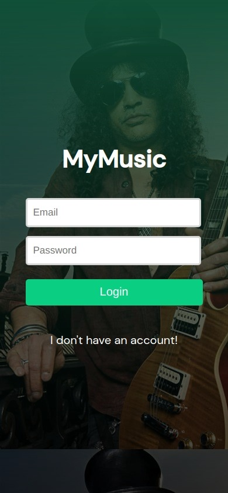
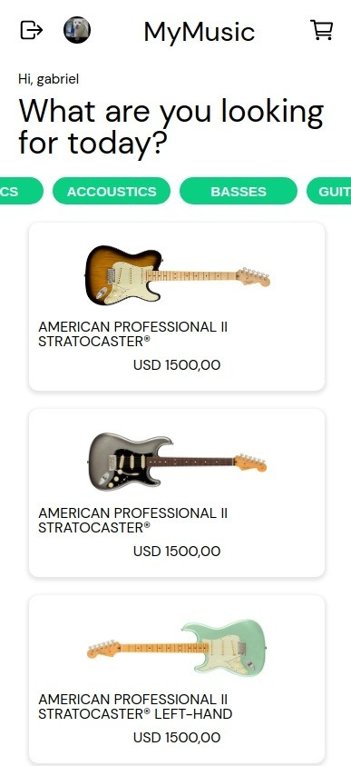
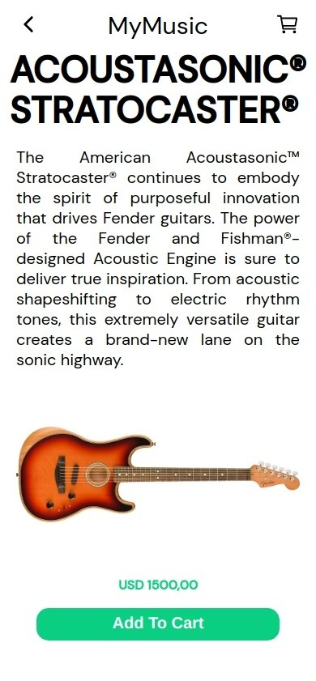
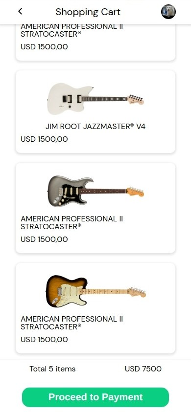
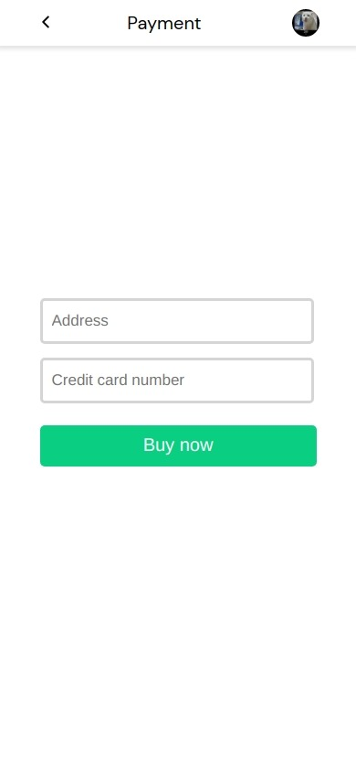
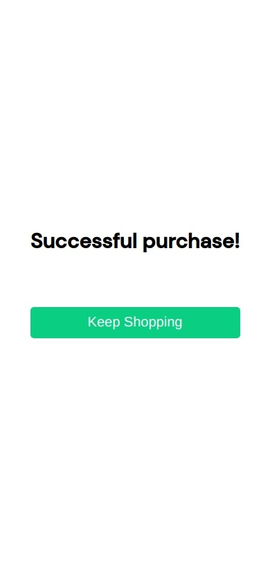

# <p align = "center"> My Music </p>

#### <p align = "center" style="color:red" > Confira também o [front-end](https://github.com/gabrzeoN/mymusic-front) </p>
##
<div align = "center" >
    
    
    
    
    
    
</div>

***

##  :clipboard: Descrição

O seu eCommerce para equipamentos musicais.

***

## :computer:	 Tecnologias e Conceitos 

- Node.js
- MongoDB
- Arquitetura em camadas
- joi
- bcrypt
- uuid

***

## 🏁 Rodando o back-end

1. Primeiro, faça o clone desse repositório na sua maquina:
```
    git clone git@github.com:gabrzeoN/mymusic-back.git
    ou
    git clone https://github.com/gabrzeoN/mymusic-back.git
```

2. Depois, dentro da pasta, rode o seguinte comando para instalar as dependencias
```
    npm install
```

3. Gere um banco de dados MongoDB e deixe o client do Mongo conectado

4. Insira os dados do array **database_example** localizado no arquivo **store_items_example** em uma coleção nomeada **instruments** no banco gerado

5. Configure o arquivo **.env**  com base no arquivo **.env.example**

6. Finalizado o processo, é só inicializar o servidor
```
npm run dev
```
